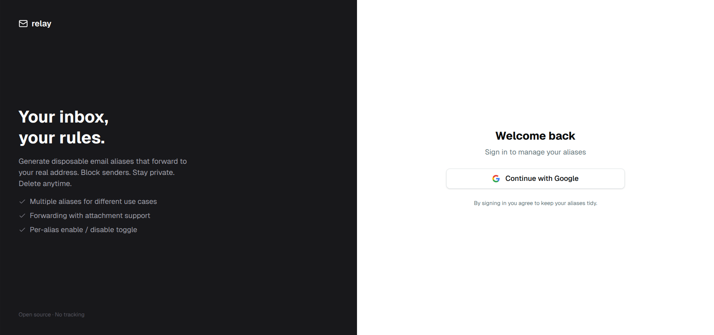

# relay


<!--  -->
<!--  -->

Create disposable email aliases that forward to your real inbox. Keep your address private, reply anonymously, disable aliases you no longer need, and stay in control.



---

## Getting started

```bash
cp .env.example .env
# fill in .env

go run ./cmd/server
cd web && npm install && npm run dev
```

Or with Docker:

```bash
docker build -t relay .
docker compose up
```

## Configuration

Copy `.env.example` to `.env` and fill in the values.

| Variable | Description |
|---|---|
| `DATABASE_URL` | Postgres connection string |
| `JWT_SECRET` | Secret for signing tokens |
| `GOOGLE_CLIENT_ID` | Google OAuth client ID |
| `GOOGLE_CLIENT_SECRET` | Google OAuth client secret |
| `GOOGLE_REDIRECT_URL` | OAuth callback URL |
| `SMTP_DOMAIN` | Domain for alias addresses |
| `SENDGRID_API_KEY` | SendGrid API key |
| `WEBHOOK_SECRET` | Secret for inbound email webhooks |
| `FRONTEND_URL` | Public URL of the app |
| `NEXT_PUBLIC_API_URL` | API URL (if backend hosted separately) |
| `SECURE_COOKIES` | Set to `false` for local dev |

<!-- ## API

```
GET    /api/auth/google              initiate Google login
GET    /api/auth/google/callback     OAuth callback

GET    /api/users/me                 get current user
DELETE /api/users/me                 delete account

GET    /api/aliases                  list aliases
POST   /api/aliases                  create alias
PATCH  /api/aliases/:id              update alias
DELETE /api/aliases/:id              delete alias

POST   /api/webhooks/email           inbound email webhook
``` -->

## License

MIT
